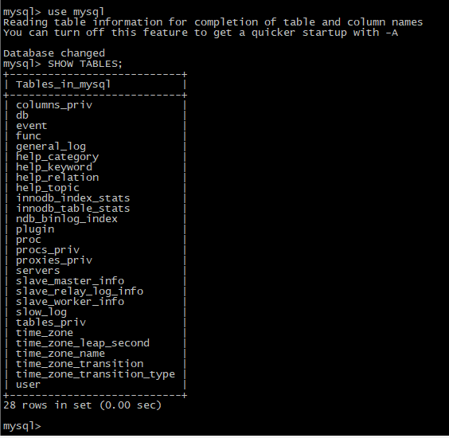
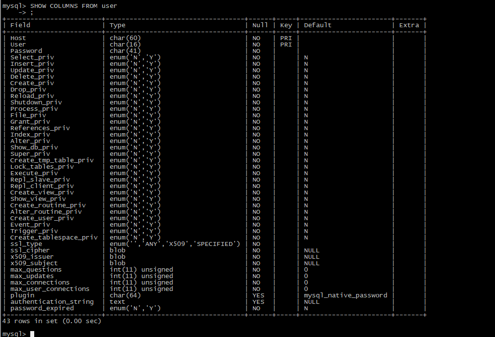
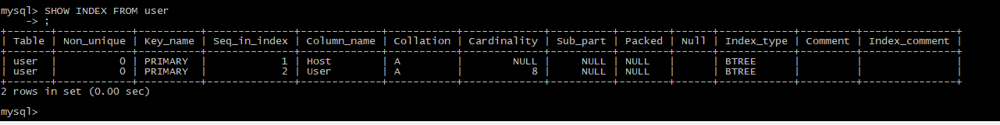

# mysql笔记

## 一、linux下安装mysql
### 确认是否已经安装过mysql
```
# yum list install mysql
```
### yum安装mysql客户端
```
# yum install mysql
```

### yum安装mysql服务器
```
# yum install mysql-server
# yum install mysql-devel
```

### yum安装mysql-server时报找不到安装包错误的解决办法
<br>


<br>
手动下载并安装mysql-server包
```
# wget http://repo.mysql.com/mysql-community-release-el7-5.noarch.rpm  
# rpm -ivh mysql-community-release-el7-5.noarch.rpm  
```
添加包到yum
```
# ls -1 /etc/yum.repos.d/mysql-community*
```
再执行install命令
```
# yum install mysql-server  
```
<br/>
## 二、运行mysql
### 启动mysql服务
```
# service mysqld start
# mysql
```

### 设置管理员密码
```
# mysqladmin -u root password "****"
```
管理员登陆
```
mysql -u root -p
Enter password: ****
```
<br/>
## 三、管理mysql数据库
### 创建新的Database
```
mysql> create database test;
```
### 创建新的管理员
1. 创建新用户`guess`：
```
mysql> create user guess;
```
1. 给`guess`设置password, 使用 `flush privileges` 命令使生效;
> mysql 新设置用户或更改密码后需用flush privileges刷新MySQL的系统权限相关表，否则会出现拒绝访问，还有一种方法，就是重新启动mysql服务器，来使新设置生效。

  ```
  mysql> update user set password=password('****') where user='guess';
  mysql> flush privileges;
  ```
1. 赋予权限
```
mysql> grant all on test.* to 'guess'@'localhost' ;
mysql> flush privileges;
```
1. 查询权限
```
mysql> show grants for guess@localhost;
```


### 管理命令

* 列出所有数据库列表 `SHOW DATABASES;`: <br/>
<br/>

<br/>
* 列出所有数据列表 `SHOW TABLES;`: <br/>
<br>

<br/>
* 显示数据表信息 `SHOW COLUMNS FROM test;`: <br/>
<br>

<br/>
* 显示数据表中的所有主键 `SHOW INDEX FROM test;`: <br/>
<br>

<br/>
